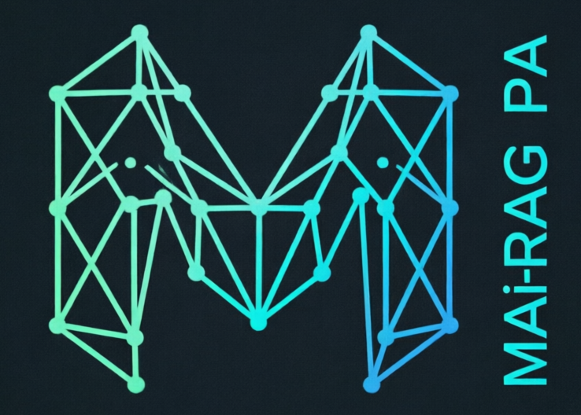

  

<h1 align="center">MAi-RAG-PA</h1>
<h3 align="center">Your Offline Privacy, Self-Healing, Personal Assistant</h3>

  <strong>MAi-RAG-PA (Memory-Augmented Intelligence with Retrieval-Augmented Generation - Personal Assistant)</strong> is a privacy-focused personal AI assistant that runs entirely on your local machine. No cloud. No subscriptions. No data leaving your computer.

  <a href="README.md">Home</a> •
  <a href="MAi-README.md">Full Documentation</a> •
  <a href="MAi-INSTALLATION.md">Installation</a> •
  <a href="MAi-OLLAMA-MODELS.md">Models</a> •
  <a href="MAi-SSH-SETUP.md">SSH & LAN</a> •
  <a href="SELF-HEALING-SYSTEM-USER-WORKFLOW.md">Self-Healing System</a> •
  <a href="CHANGELOG.md">Changelog</a> •
  <a href="MAi-LICENCE-LEGAL-NOTICE.md">License</a>

  <strong>Version 1.0 | Effective Date: June 2026</strong> 
  <strong>Copyright © 2026 MAi-RAG-PA. All Rights Reserved.</strong>

-----------------------------------------------------------------------------------

# Changelog

All notable changes to MAi-RAG-PA will be documented in this file.

The format is based on [Keep a Changelog](https://keepachangelog.com/en/1.0.0/),
and this project adheres to [Semantic Versioning](https://semver.org/spec/v2.0.0.html).

## [1.0.0] - 2026-07-11

### Initial Release

First public release of MAi-RAG-PA - Your Offline Privacy, Self-Healing, Personal Assistant.

### Added

#### Core Features
- **Dual-Layer Memory System**
  - Short-Term Memory (STM) with SQLite database for chat history, reminders, events, todos
  - Long-Term Memory (LTM) with Qdrant vector database for RAG knowledge base
  - Automatic learning from conversations to build user profile

- **Chat Console**
  - Multi-threaded conversations with persistent SQLite storage
  - Real-time system resource monitoring (CPU, RAM, Swap)
  - Dynamic model selection from Ollama
  - Protected model warnings for missing system models
  - Voice-to-text input with offline Vosk model
  - File attachments for context
  - Copy button for all messages
  - Auto-titling of threads based on first message

- **Agentic File Creation Pipeline**
  - Generate → Verify → Fix → Save workflow
  - File overwrite protection with automatic numbered suffixes
  - Syntax validation (Python: ast.parse, JSON: json.loads, Text: structure checks)
  - Support for 16 file types (txt, md, py, js, ts, json, yaml, etc.)
  - Two creation methods: `[FILE]` prefix and natural language detection

- **Self-Healing System**
  - Sandboxed code repair environment (`~/MAi-RAG-PA/dev-sandbox/MAi-RAG-DEV/`)
  - Model capability gating (only enabled for capable models)
  - Safety rules: path validation, infinite loop prevention, operation limits
  - Instant rollback capability
  - Support for both Dense and MoE models

- **RAG Integration**
  - 17 document formats supported (PDF, EPUB, DOCX, TXT, MD, HTML, CSV, JSON, XML, PPTX, XLSX, TEX, RST, RTF, ODT, TSV, HTM)
  - Semantic chunking with SpaCy sentence tokenization
  - all-MiniLM-L6-v2 embeddings (384 dimensions)
  - Mandatory citation system with inline references
  - End-of-response References section with full source details
  - Change detection with SHA256 hashing

- **Calendar & Task Management**
  - Multi-view calendar (Year, Month, Week, Day)
  - Event management with recurring events
  - Customizable reminders (24h, 1h, 30m, 15m, 5m, at-time)
  - To-Do manager with priorities and due dates
  - Browser notifications and toast pop-ups

- **System Prompt Management**
  - Single source of truth (agent_core.py)
  - Custom prompt storage in SQLite
  - API endpoint for default prompt retrieval
  - Live editing without restart
  - Conditional injection of tool-calling and self-healing protocols

- **Hardware-Aware Model Recommendations**
  - Automatic hardware detection (RAM, CPU cores)
  - Tier-based recommendations (High, Medium, Consumer, Minimal)
  - Protected system model: codeqwen:7b for STM parsing and self-healing
  - MoE vs Dense model guidance

- **Text Editor**
  - Multi-format support (16 file types)
  - Syntax highlighting
  - File System Access API for Chrome/Edge/Vivaldi
  - Fallback to workspace for Firefox
  - AI-assisted editing and code generation

- **24 Color Themes**
  - Dark themes: Deep Space Teal, Purple/Yellow, Blue/Orange, Pink/Cyan, Dark Grey, Forest Green, Sunset Orange, Ocean Blue, Royal Purple, Crimson Red, Amber Gold, Midnight Blue, Emerald Mint, Lavender Dream, Monochrome, Cyberpunk Neon, Volcanic Ash, Bamboo Grove, Nebula Drift, Copper/Teal, Rose Quartz, Graphite, Solar Flare
  - Light themes: Arctic Frost
  - Theme-aware backgrounds and accents

- **API & Security**
  - API key management with auto-generation
  - Input validation and sanitization
  - Path traversal protection
  - Rate limiting
  - Field-level encryption support
  - WebSocket for real-time updates

- **Installation & Deployment**
  - Universal installer for Linux (Debian/Ubuntu, Fedora/RHEL, Arch), macOS, Windows (WSL2)
  - Automatic dependency installation
  - Protected model auto-pull (codeqwen:7b)
  - Database initialization and system prompt seeding
  - Desktop launcher creation
  - Docker support

- **Documentation**
  - Comprehensive README with feature overview
  - Installation guide with troubleshooting
  - Model recommendations guide
  - SSH & LAN setup guide
  - Complete architecture documentation
  - Legal notice and license information

#### Technical Infrastructure
- **Backend**: FastAPI with async/await endpoints
- **Frontend**: React 18 with TypeScript and Vite
- **Database**: SQLite for STM, Qdrant for LTM
- **LLM Integration**: Ollama via LangChain
- **Embeddings**: all-MiniLM-L6-v2
- **NLP**: SpaCy for chunking and text processing
- **Voice**: Vosk for offline speech recognition
- **Metrics**: Prometheus metrics for monitoring
- **Logging**: Structured logging with rotation
- **Caching**: LLM instance caching for performance

### Fixed

- Chat history now persists in SQLite database (previously stored in browser cache)
- System prompt consistency across frontend, backend, and database
- File path consistency throughout codebase (MAi-RAG-PA paths)
- Citation enforcement in all knowledge base responses
- Model recommendations now hardware-aware
- File creation no longer overwrites existing files (adds numbered suffix)
- Protected model warnings display correctly in WebUI
- System prompt seeding during installation (database initialized first)
- Cross-platform RAM detection in installer
- Backup creation before updates in installer

### Security

- API key authentication on all endpoints
- Input sanitization and validation
- Path traversal protection with forbidden directory list
- Sandbox isolation for self-healing operations
- Rate limiting on API endpoints
- Secure API key generation using `secrets.token_urlsafe()`
- No hardcoded secrets in codebase
- Privacy-first design (all data stays local)

### Documentation

- Complete API documentation in ARCHITECTURE.md
- Installation guide with platform-specific instructions
- Model selection guide with hardware recommendations
- Architecture documentation with data flow diagrams
- Troubleshooting guide for common issues
- SSH & LAN setup for remote access

### Design Goals Achieved

- **Privacy**: All processing happens locally, no cloud dependencies
- **Reliability**: Agentic verification pipeline ensures zero broken code
- **Performance**: Hardware-aware model selection and caching
- **Extensibility**: Modular architecture with clear separation of concerns
- **User Experience**: Intuitive WebUI with 24 themes and responsive design
- **Maintainability**: Self-healing system and comprehensive documentation

### Dependencies

- Python 3.12+
- Node.js 20+
- Ollama 0.30+
- Qdrant 1.17+
- FastAPI, Uvicorn, LangChain
- React 18, TypeScript, Vite
- SpaCy, Sentence Transformers
- Vosk (bundled model)

### Acknowledgments

Built on the shoulders of giants:
- [Ollama](https://ollama.ai) - Local LLM inference
- [Qdrant](https://qdrant.tech) - Vector database
- [FastAPI](https://fastapi.tiangolo.com) - Backend framework
- [React](https://react.dev) - Frontend framework
- [Hugging Face](https://huggingface.co) - Embedding models
- [SpaCy](https://spacy.io) - NLP processing

### What's Next

- Advanced RAG Dataset ingestion capabilities (multi-modal documents)
- Automated backups
- Let us know what featues you would like implemented.

---

## Version History

| Version | Release Date | Description |
|---------|-------------|-------------|
| 1.0.0   | 2026-07-11  | Initial Release |

---

**Full Documentation**: [MAi-README.md](MAi-README.md)
**Installation Guide**: [MAi-INSTALLATION.md](MAi-INSTALLATION.md)
**Model Recommendations**: [MAi-OLLAMA-MODELS.md](MAi-OLLAMA-MODELS.md)
**Docker Guide**: [DOCKER.md](DOCKER.md)
**SSH Setup**: [MAi-SSH-SETUP.md](MAi-SSH-SETUP.md)
**Licence & Legal Notice**: [MAi-LICENCE-LEGAL-NOTICE.md](MAi-LICENCE-LEGAL-NOTICE.md)
**Architecture**: [ARCHITECTURE.md](ARCHITECTURE.md)

**Issues**: [GitHub Issues](https://github.com/MAi-RAG-PA/MAi-RAG-PA/issues)
**Discussions**: [GitHub Discussions](https://github.com/MAi-RAG-PA/MAi-RAG-PA/discussions)
**Email**: MAi-RAG-PA@proton.me

---

  <strong>MAi-RAG-PA — Your Personal Assistant, Your Data, Your Machine, No Subscriptions!</strong>

