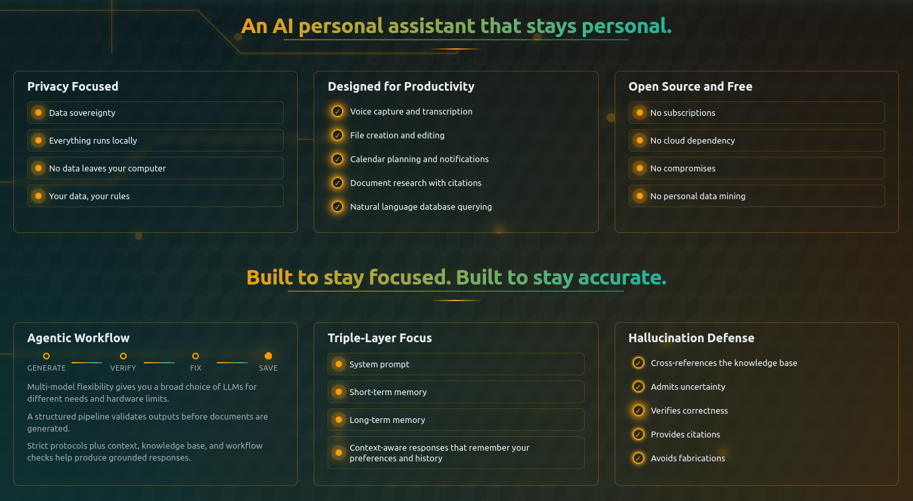

  

<h1 align="center">MAi-RAG-PA</h1>
<h3 align="center">Your Offline Privacy, Self-Healing, Personal Assistant</h3>

  <strong>MAi-RAG-PA (Memory-Augmented Intelligence with Retrieval-Augmented Generation - Personal Assistant)</strong> is a privacy-focused personal AI assistant that runs entirely on your local machine. No cloud. No subscriptions. No data leaving your computer.

  

  <a href="README.md">Home</a> •
  <a href="MAi-README.md">Full Documentation</a> •
  <a href="MAi-INSTALLATION.md">Installation</a> •
  <a href="MAi-OLLAMA-MODELS.md">Models</a> •
  <a href="MAi-SSH-SETUP.md">SSH & LAN</a> •
  <a href="SELF-HEALING-SYSTEM-USER-WORKFLOW.md">Self-Healing System</a> •
  <a href="CHANGELOG.md">Changelog</a> •
  <a href="MAi-LICENCE-LEGAL-NOTICE.md">License</a>

  <strong>Version 1.0 | Effective Date: June 2026</strong> 
  <strong>Copyright © 2026 MAi-RAG-PA. All Rights Reserved.</strong>

-----------------------------------------------------------------------------------

## What is MAi-RAG-PA?

**MAi-RAG-PA is a complete AI-powered productivity suite that runs 100% locally on your machine:**
- Chat Console - Multi-threaded conversations with any Ollama model
- Text Editor - Multi-format editor with AI assistance
- Long-Term Memory - Ingest 17 document formats (PDF, EPUB, DOCX, PPTX, XLSX, etc.) into a vector database
- Calendar & Planner - Full-featured scheduling with smart reminders
- Voice Recognition - Offline speech-to-text with Faster Whisper & Vosk
- Agentic Workflows - Generate files with automatic verification
- 100% Private - No data ever leaves your machine

### System Requirements
- **OS**: Linux (Ubuntu 22.04+, Fedora 38+, Arch), macOS 12+, Windows (WSL2), and others

### Minimum Hardware
- **CPU**: Intel i3 / AMD Ryzen 3 or better
- **RAM**: 8GB minimum (16GB recommended for optimal performance)
- **Storage**: 10GB free space (plus space for AI models)

### Recommended Hardware
- **CPU**: Intel i5/i7 / AMD Ryzen 5/7 (8+ cores)
- **RAM**: 16GB+ (32GB for large models)
- **Storage**: SSD with 50GB+ free space
- **GPU**: Optional (NVIDIA GPU with CUDA support accelerates inference)

### Model Requirements by Hardware Tier

| Hardware Tier | RAM | Recommended Models | Performance |
|---------------|-----|-------------------|-------------|
| **High-End** | 32GB+ | Qwen3-235B-A22B (MoE), Mixtral-8x22B | Excellent |
| **Mid-Range** | 16GB | Qwen3-30B-A3B (MoE), Qwen2.5-Coder-14B | Very Good |
| **Consumer** | 8-12GB | Qwen2.5-Coder-7B, CodeQwen-7B | Good |
| **Minimal** | <8GB | Qwen2.5-3B, Phi-3-mini | Basic |

**Protected System Model:**
- **codeqwen:7b** is automatically installed and required for optimal system performance
- Handles Short-Term Memory parsing, self-healing operations, and basic chat
- Uses ~4.5GB RAM
- Do not remove unless you understand the consequences

-----------------------------------------------------------------------------------

## What Can You Do With MAi-RAG-PA?

**MAi-RAG-PA isn't just a chatbot — it's a complete AI-powered productivity suite running entirely on your local machine.**

**Key Features:**

### Model Support
- **Works with any Ollama model** - from 1.5B lightweight models to 671B reasoning giants. See Model Recommendations for guidance.

### Privacy & Security
- **100% Offline Operation**: Runs without internet after initial setup
- **Complete Data Sovereignty**: No accounts, no registration, no data collection
- **Local Storage**: SQLite database and Qdrant vectors live on your filesystem
- **No Telemetry**: Zero tracking or analytics
- **Encryption Ready**: Database encryption and SSH tunneling supported

### Open Source
- **Full transparency of code**
- **Community auditable**
- **No hidden functionality**

### Professional Productivity
- **Contract Drafting**: Generate legal documents with LLM assistance that understands context
- **Spreadsheet Generation**: Create CSV and structured data files from natural language
- **Email & Correspondence**: Draft professional communications with contextual awareness
- **Code Generation**: Create and verify Python, JavaScript, TypeScript, HTML, CSS, SQL files with automatic syntax validation
- **Project Management**: Integrated task tracking and calendar coordination
- **Research & Knowledge Management**: Ingest Documents into a persistent knowledgebase with semantic search and citation tracking

**Supported Document Formats (17 total):**
- **Documents**: PDF, EPUB, DOCX, TXT, RTF, ODT
- **Web**: HTML, HTM, MD (Markdown)
- **Data**: CSV, TSV, JSON, XML
- **Office**: PPTX (PowerPoint), XLSX (Excel)
- **Academic**: TEX (LaTeX), RST (reStructuredText)

### Creative & Content Generation
- **Write blog posts, articles, Books, and Creative Content**
- **Generate code in any programming language with syntax verification**
- **Create technical documentation from specifications**
- **Draft marketing copy with brand voice consistency**
- **Develop educational materials with structured lesson plans**

### Personal Productivity
- **Calendar & Scheduling**: Full-featured calendar with year/month/week/day views, recurring events, and conflict detection
- **To-Do Management**: Task lists with priorities, due dates, and smart notifications
- **Note-Taking**: Rich text editor supporting 16+ file formats with browser-native file saving
- **Journaling**: Private diary entries with semantic search
- **Learning Assistant**: Upload textbooks and quiz yourself using your personal knowledge base
- **Intelligent Reminders**: Context-aware reminders that understand priority

### Technical Capabilities
- **Self-Healing System**: Built-in System Doctor with diagnostics and auto-fix
- **Multi-Model Orchestration**: Switch between 20+ Ollama models mid-conversation
- **Voice Transcription**: Local Vosk-powered speech-to-text (offline)
- **Agentic File Creation**: Generate files with automatic verification - no broken code reaches your filesystem
- **Cross-Device Access**: SSH into your MAi-RAG-PA instance from tablets, phones, or other computers

## Knowledge Base Integration

**Every time you send a query, MAi-RAG-PA automatically triggers a database search. The LLM receives:**

1. **Your knowledge base** (injected as system message with source citations)
2. **Its own training data** (built into the model)
3. **System prompt instructions** to use retrieved information when relevant

**The LLM:**
1. Reads retrieved documents from Long-Term Memory
2. Decides if they're relevant
3. Combines them with its own knowledge
4. Generates response…datory Citation Format:**

**Mandatory Citation Format:**
- Inline citations: "blue [Source 1: file.txt]"
- End-of-response References section with full source details
- Clear distinction between knowledge base and training data sources

**Benefits:**
- Grounded responses based on your actual documents
- Fallback to general knowledge when needed
- Automatic citation tracking with page numbers and authors
- No manual context management required

-----------------------------------------------------------------------------------

## Features (UI Walkthrough)

### 1. Navigation Menu (Top Header)

**The sticky header provides instant access to all system functions:**
- **Logo Click**: Instantly scrolls to the top of the page
- **Section Links**: Jump directly to Chat Console, Notes, Memory, Planner, or Settings
- **Theme Selector**: 24 unique color themes (Dark Space Teal, Cyberpunk Neon, Arctic Frost, etc.)
- **Start/Stop Buttons**: Control MAi-RAG-PA backend service directly from the UI

### 2. Chat Console (The Brain)

**Your primary interface for AI interaction with multi-threaded conversations and system monitoring.**
#### Threads Pane (Left Sidebar)
- **Conversation History**: All chats saved in local SQLite database
- **Persistent Storage**: Survives browser sessions, device changes, and system restarts
- **Auto-Title**: Threads automatically name themselves based on first message
- **Thread Management**: Create new chats, delete old ones with one click
- **Database-Backed**: All messages stored in SQLite, not browser cache

#### System Resources Monitor

**Real-time visibility into your machine's health:**
- **CPU Usage**: Live percentage with color-coded progress bar
- **RAM Usage**: Current vs. total available memory
- **Swap Usage**: Monitor virtual memory to prevent crashes
- **Auto-Refresh**: Updates every 30 seconds

#### Model Selector
- **Dynamic Loading**: Fetches models live from Ollama's API
- **Smart Filtering**: Embedding models automatically hidden
- **Protected Model Indicator**: System models marked with ⚙️ icon
- **Set as Default**: Choose permanent default model
- **Hot-Swapping**: Change models without restarting

**Protected Models Warning:**
If required system models are missing, a warning appears under the model selector explaining which models are needed and why.

#### Chat Interface
- **Multi-Turn Conversations**: Context-aware responses with memory
- **Clean Rendering**: Automatic stripping of AI reasoning tokens
- **Abort Button**: Stop long-running generations mid-stream
- **File Creation**: Use `[FILE]` prefix or natural language to generate files
- **Copy Button**: One-click copy of any message to clipboard
- **Complete Responses**: Full AI responses shown in chat (not truncated)

#### Voice-to-Text Input
- **Offline Operation**: Uses bundled Vosk model (vosk-model-small-en-us-0.15)
- **16kHz Mono Recording**: Optimized for speech recognition
- **Visual Feedback**: Microphone button pulses red while recording
- **Auto-Insert**: Transcribed text automatically added to input field

#### File Attachments
- Attach PDF, DOCX, TXT, MD, HTML files for context
- AI reads and incorporates file content into conversation
- Useful for document analysis and information extraction

### 3. Text Editor (Notes & Code)

**Multi-format editor supporting 16 file types:**
- **Text & Docs**: .txt, .md, .html, .css, .xml, .ini, .cfg, .log
- **Programming**: .py, .js, .ts, .sh, .sql
- **Data**: .json, .yaml, .yml, .toml, .csv

**Smart File Handling:**
- **Chrome/Edge/Vivaldi**: Files save directly to original location using File System Access API
- **Firefox**: Files save to `~/MAi-RAG-PA/workspace/` due to security policies
- **Syntax Highlighting**: Automatic detection based on file extension
- **Find Function**: Ctrl+F to search within current file

**AI-Assisted Editing:**
- Request code improvements, refactoring, or optimization
- Generate documentation comments
- Convert between file formats
- Find and fix bugs or syntax errors

### 4. Memory System (Dual-Layer Architecture)

#### Long-Term Memory (LTM) - Qdrant Vector Database

**Your personal knowledgebase that guides AI responses:**

**Supported Document Formats (17 formats):**
- **Documents**: PDF, EPUB, DOCX, TXT, RTF, ODT
- **Web**: HTML, HTM, MD (Markdown)
- **Data**: CSV, TSV, JSON, XML
- **Presentations**: PPTX (PowerPoint)
- **Spreadsheets**: XLSX (Excel)
- **Academic**: TEX (LaTeX), RST (reStructuredText)
- **All document processing is handled automatically - no additional system packages required.**

**How to Use:**
1. Select existing database or create new one
2. Upload single file or entire directory (ensure the directory is subject-centric)
3. Documents automatically chunked and embedded
4. AI references your documents when answering questions

**Best Practices:**
- Organize by topic (Tax-Code-Database, Biology-Database, Finance-Expenses)
- Use clear, descriptive filenames
- Separate databases for different subjects speed up searches

**Technical Details:**
- **Document Ingestion**: All 17 formats supported
- **Semantic Chunking**: SpaCy sentence tokenization with overlap
- **Vector Embeddings**: all-MiniLM-L6-v2 model (384 dimensions)
- **Persistent Storage**: Qdrant collections organized by topic
- **RAG Retrieval**: Automatic search with source citations
- **Rich Metadata**: Author, title, creation date, auto-extracted keywords
- **Change Detection**: Skip unchanged files using SHA256 hashing

#### Short-Term Memory (STM) - SQLite Database

**Operational memory that grows with you:**
- **Chat History**: All conversations with timestamps and thread organization (SQLite-backed)
- **Calendar Data**: Events, appointments, reminders, tasks
- **To-Do Lists**: Tasks with priorities and due dates
- **User Facts**: Information learned from conversations (preferences, role, context)
- **System Settings**: Custom prompts, heartbeat intervals, notifications, API keys
- **Model Preferences**: Default model selection and protected model status

**Automatic Learning:**
- Observes patterns in conversations
- Extracts facts like name, role, preferences
- Provides personalized responses based on context

**Data Persistence:**
- All STM data stored in SQLite database (`~/MAi-RAG-PA/memory/memory_store.db`)
- Survives browser cache clears, system restarts, and device changes
- Automatic backups and integrity checks
- No data loss from browser updates or cache clearing

### 5. Calendar Planner

**Full-featured time management system:**

**Multi-View Calendar:**
- **Year View**: All 12 months at a glance
- **Month View**: Detailed grid with event pills
- **Week View**: 7-day cards with hour-by-hour breakdown
- **Day View**: Full hourly timeline with action buttons

**Event Management:**
- Create/Edit/Delete events with rich metadata
- Recurring events (daily, weekly, monthly, yearly)
- End date or indefinite recurrence
- Edit or delete all instances at once

**Alerts & Notifications:**
- Customizable reminders (24h, 1h, 30m, 15m, 5m, at time)
- Browser notifications when events are due
- Upcoming events panel (next 15 events)
- Toast notifications (non-intrusive pop-ups)

**To-Do Manager:**
- Task lists with priorities (low, medium, high)
- Due dates with overdue/upcoming filters
- Integration with calendar events

### 6. Assistant Settings

**Control center for MAi-RAG-PA's behavior and maintenance:**

#### System Doctor (One-Click Diagnostics)

**Comprehensive health check:**

**Diagnostic Checks:**
- Ollama connectivity and model count
- Qdrant vector database status
- SQLite database integrity
- Workspace directory permissions
- Frontend build existence
- Disk space availability
- Python dependency verification
- Protected model status

**Auto-Fix Capabilities:**
- Rebuilds corrupted virtual environments
- Restarts unresponsive services
- Clears orphaned Qdrant blobs
- Re-pulls missing Ollama models

**Health Score:** 0-100% with color-coded status (green ≥80%, yellow ≥60%, red <60%)

#### Self-Healing System

**AI-powered code repair in a safe sandbox environment:**

**How It Works:**
1. System detects errors or receives fix requests
2. Capable AI models analyze the issue
3. Code modifications made in isolated sandbox (`~/MAi-RAG-PA/dev-sandbox/MAi-RAG-DEV/`)
4. User reviews changes before deployment
5. Instant rollback if issues arise

**Safety Features:**
- Isolated sandbox prevents damage to main codebase
- Path validation prevents infinite loops
- File operation limits (max 50 files, 10 depth levels)
- User approval required for all changes
- Instant revert capability

**Supported Models:**
- Dense: Qwen2.5-Coder (14B, 32B), CodeQwen-7B, Devstral-24B
- MoE: Qwen3-30B-A3B, Qwen3-235B-A22B, Mixtral-8x7B, DeepSeek-V2

#### Notification Schedule
- Interval toggles (24h, 1h, 30m, 15m, 5m, at-time)
- Quiet hours to suppress notifications
- Browser permission for native notifications

#### System Prompt Editor

**Unified system prompt management:**

**Single Source of Truth:**
- Default prompt stored in `agent_core.py`
- Custom prompts saved to SQLite database
- Frontend fetches from backend API (no hardcoded duplicates)
- Changes take effect immediately (no restart required)

**Default Prompt Features:**
- Comprehensive behavioral protocols
- Mandatory citation requirements
- Tool-calling instructions
- Technical standards
- Security guidelines

**Customization Tips:**
- Edit to match your specific needs
- Add domain-specific instructions
- Include company terminology
- Adjust tone (formal, casual, technical)
- Reset to default anytime

#### Heartbeat Configuration

**Background process for system health monitoring:**
- **Interval Setting**: Configure check frequency (default: 5 minutes)
- **Silent Operation**: Runs without user intervention
- **Alert Trigger**: Notifies if critical issues detected

**Monitors:**
- Ollama responsiveness
- Qdrant availability
- Database connection
- File system access
- Memory usage

-----------------------------------------------------------------------------------

## Agentic Workflow: Generate → Verify → Fix → Save

**Zero broken code ever reaches your filesystem.**

MAi-RAG-PA's signature feature — a deterministic verification pipeline ensuring every AI-created file is syntactically valid and structurally sound.

### The Pipeline

**1. GENERATE**
- LLM creates content based on your request
- Uses selected model and system prompt
- Incorporates conversation context

**2. VERIFY**

**Content checked against strict rules:**
- **.py files** → `ast.parse()` guarantees valid Python syntax
- **.json files** → `json.loads()` guarantees valid JSON structure
- **.txt/.md files** → Structure checks (paragraphs, capitalization, grammar)
- **Other files** → Basic non-empty check

**3. FIX (if needed)**
- If verification fails, error fed back to LLM
- LLM attempts correction
- Up to 3 retry attempts
- Each attempt logged for debugging

**4. SAVE**
- Only verified content written to disk
- Files saved to `~/MAi-RAG-PA/workspace/` (or original location in Chrome/Edge)
- **Overwrite Protection**: If file exists, numbered suffix added (e.g., `Philosophy_1.txt`)
- User receives confirmation with file path and size

### File Overwrite Protection

**Automatic numbering prevents accidental data loss:**

When creating a file that already exists:
1. System checks if filename exists in workspace
2. If exists, adds numbered suffix: `filename_1.ext`, `filename_2.ext`, etc.
3. Continues until unique name found
4. Logs the name change for transparency

**Example:**
- Request: "Create Philosophy.txt"
- If `Philosophy.txt` exists → creates `Philosophy_1.txt`
- If that exists → creates `Philosophy_2.txt`
- And so on...

### Supported File Types

| Extension | Verification Method | What's Checked |
|-----------|---------------------|----------------|
| .py | ast.parse() | 100% Python syntax validity |
| .json | json.loads() | Valid JSON structure |
| .txt | Heuristic rules | Paragraph breaks, capitalization, typo detection |
| .md | Heuristic rules | Same as .txt + Markdown-aware structure |
| Other | Basic check | Non-empty content |

### File Creation Methods

**Method 1: Explicit `[FILE]` Prefix (Most Reliable)**

    [FILE] Create notes.txt with content: Hello World
    [FILE] Write adder.py: def add(a,b): return a+b
    [FILE] Save config.json with {"key": "value"}

**Pros:** Zero false positives, easy to debug, works with any phrasing
**Cons:** Requires remembering the prefix

**Method 2: Natural Language (Smart Regex)**

- Save these notes to my_notes.txt: Hello World
- Write a Python function named adder.py that adds two numbers
- Create config.json with {"app": "MAi-RAG-PA", "version": "1.0"}

**Pros:** Works with natural language, no prefix required
**Cons:** Slightly higher risk of false positives

### Self-Correction Example

**Request:** "Create a Python function with a syntax error"

**Attempt 1:**
- Generated: `def broken(  # missing parenthesis`
- Verified: ✗ SyntaxError: unexpected EOF
- Action: Feed error back to LLM + retry

**Attempt 2:**
- Generated: `def broken(): return 42`
- Verified: ✓ Syntax OK
- Action: Save to workspace/

**Note:** If you explicitly request broken code, the system retries up to 3 times but ultimately fails — preventing broken code from being saved.

-----------------------------------------------------------------------------------

## Quick Start

    # Clone the repository
    git clone https://github.com/MAi-RAG-PA/MAi-RAG-PA.git
    cd MAi-RAG-PA

    # Run the installer (handles everything)
    ./install.sh

    # Or start directly if dependencies are already installed
    ./start.sh

**Visit http://localhost:8000 to access the web interface.**

-----------------------------------------------------------------------------------

## Documentation

<a href="MAi-README.md">Full Documentation</a> Complete feature overview and usage guide 
<a href="MAi-INSTALLATION.md">Installation</a> Step-by-step setup for all platforms, System requirements, starting/stopping 
<a href="MAi-OLLAMA-MODELS.md">Model Recommendations</a> Choosing the right AI model for your needs 
<a href="SELF-HEALING-SYSTEM-USER-WORKFLOW.md">Self-Healing System</a> Guide on the Self-Healing System Initiation Process 
<a href="MAi-SSH-SETUP.md">SSH & LAN</a> Access the system remotely from other devices via SSH or on the same network 
<a href="CHANGELOG.md">Changelog</a> 
<a href="MAi-LICENCE-LEGAL-NOTICE.md">Terms of use and commercial licensing</a>

## Support & Contact

**Issues**: [GitHub Issues](https://github.com/MAi-RAG-PA/MAi-RAG-PA/issues)
**Discussions**: [GitHub Discussions](https://github.com/MAi-RAG-PA/MAi-RAG-PA/discussions)
**Email**: MAi-RAG-PA@proton.me

-----------------------------------------------------------------------------------

## 💝 Support MAi-RAG-PA

MAi-RAG-PA is a labor of love developed over thousands of hours. If this software brings value to your life or work, **donations are deeply appreciated** and help fund continued development.

MAi-RAG-PA is free for personal use. If you find it valuable, donations are greatly appreciated:

- **PayPal**: <a href="https://www.paypal.com/ncp/payment/GSTCK29MSGCH4">Grateful for your Contributions</a>

Every donation helps keep MAi-RAG-PA free and continuously improving.

**Commercial Licensing**: For business deployments or enterprise support, please contact: MAi-RAG-PA@proton.me

-----------------------------------------------------------------------------------

  <strong>MAi-RAG-PA — Your Personal Assistant, Your Data, Your Machine, No Subscriptions!</strong>

  Version 1.0.0 | Released June 2026

