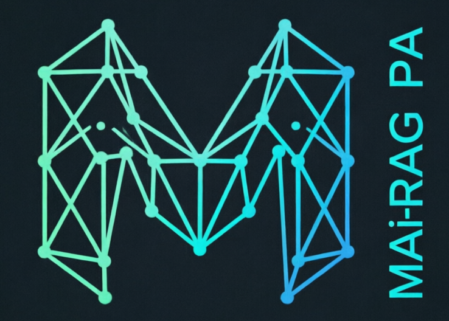

<p align="center">
  
</p>

<h1 align="center">MAi-RAG-PA</h1>
<h3 align="center">Your Offline Privacy, Self-Healing, Personal Assistant</h3>

<p align="center">
  <strong>MAi-RAG-PA (Memory-Augmented Intelligence with Retrieval-Augmented Generation - Personal Assistant)</strong> is a privacy-focused personal AI assistant that runs entirely on your local machine. No cloud. No subscriptions. No data leaving your computer.
</p>

<p align="center">
  <a href="https://github.com/MAi-RAG-PA/MAi-RAG-PA/blob/main/README.md">🏠 Home</a> •
  <a href="https://github.com/MAi-RAG-PA/MAi-RAG-PA/blob/main/MAi-README.md">📚 Full Docs</a> •
  <a href="https://github.com/MAi-RAG-PA/MAi-RAG-PA/blob/main/MAi-INSTALLATION.md">⚙️ Installation</a> •
  <a href="https://github.com/MAi-RAG-PA/MAi-RAG-PA/blob/main/MAi-OLLAMA-MODELS.md">🤖 Models</a> •
  <a href="https://github.com/MAi-RAG-PA/MAi-RAG-PA/blob/main/MAi-SSH-SETUP.md">🌐 SSH & LAN</a> •
  <a href="https://github.com/MAi-RAG-PA/MAi-RAG-PA/blob/main/SELF-HEALING-SYSTEM-USER-WORKFLOW.md">🩺 Self-Healing</a> •
  <a href="https://github.com/MAi-RAG-PA/MAi-RAG-PA/blob/main/CHANGELOG.md">📝 Changelog</a> •
  <a href="https://github.com/MAi-RAG-PA/MAi-RAG-PA/blob/main/MAi-LICENCE-LEGAL-NOTICE.md">⚖️ License</a>
</p>

---


<p align="center">
  <strong>Version 1.0 | Effective Date: June 2026</strong><br />
  <strong>Copyright © 2026 MAi-RAG-PA. All Rights Reserved.</strong>
</p>

---

# MAi-RAG-PA Self-Healing System User Workflow Guide

## Table of Contents

- [Overview](#overview)
- [At a Glance](#at-a-glance)
- [How to Trigger the Self-Healing System](#how-to-trigger-the-self-healing-system)
- [Project Structure](#project-structure)
- [Sandbox Initialization](#sandbox-initialization)
- [Model Capability Check](#model-capability-check)
- [Hardware Requirements](#hardware-requirements)
- [Self-Healing Request Flow](#self-healing-request-flow)
- [Tool Activation & Available Tools](#tool-activation--available-tools)
- [Self-Healing Workflow](#self-healing-workflow)
- [Path Validation & Monitoring](#path-validation--monitoring)
- [Capabilities & Model Guidance](#capabilities--model-guidance)
- [Critical Safety Rules](#critical-safety-rules)
- [Troubleshooting](#troubleshooting)
- [Complete Workflow Example](#complete-workflow-example)
- [Proactive Self-Healing Workflow (The MAi-RAG Way)](#proactive-self-healing-workflow-the-mai-rag-way)
- [Updating MAi-RAG-PA](#updating-mai-rag-pa)

---

## Overview

The MAi-RAG-PA self-healing system lets the AI assistant read, analyze, and fix code inside a controlled sandbox. It is designed to diagnose errors, identify bugs, and produce corrections safely while preserving the privacy and local-only operation of the assistant.

## At a Glance

- **Sandbox:** `~/MAi-RAG-PA/dev-sandbox/MAi-RAG-DEV/`
- **Core workflow:** detect → read → analyze → fix → verify
- **Primary routing method:** keyword-based tool activation
- **Main purpose:** safe autonomous code repair and proactive system improvement

---

## How to Trigger the Self-Healing System

**You do not need to know any code, file names, or special commands.** The Self-Healing System is triggered naturally through everyday language in the Chat Console. 

The AI listens for conversational keywords related to troubleshooting or creation, such as:
**`fix` • `broken` • `error` • `diagnose` • `not working` • `create` • `write` • `backup`**

### Scenario 1: The Non-Technical User (System Malfunction)
If the system is acting up, simply describe the symptom. The AI will guide you.

> **User:** "The chat console is broken and not saving my messages. How do I fix it?"
> **AI:** "I can help diagnose that. Could you copy and paste any error messages you see, or describe exactly what happens when you try to send a message?"
> *(Once you provide the detail, the AI will proactively read the relevant live files, identify the bug, write the corrected code to the safe sandbox, and generate a `SELF_HEALING_LOG.md` with simple, step-by-step instructions for you to apply the fix.)*

### Scenario 2: The Developer / Power User (Specific File Fix)
If you know the file causing the issue, you can be direct.

> **User:** "There is a syntax error in `app/agents/agent_core.py` on line 120. Please fix it."
> **AI:** *(Automatically reads the live file, diagnoses the issue, writes the corrected version to the sandbox, and provides the deployment log.)*

### Scenario 3: Creative File Generation
Keywords like "create" or "write" also trigger the AI's file-generation pipeline for your personal projects, not just system fixes.

> **User:** "Create a new file named `index.html` in the workspace with a basic layout for a personal portfolio website."
> **AI:** *(Generates the complete, verified HTML code and saves it directly to your `workspace/` directory.)*

---

## Project Structure

Understanding the project layout is critical for safe self-healing operations:

- `app/` - Backend Python code. Modify with caution.
- `frontend/src/` - Frontend React code. Modify with caution (e.g., `components/chat/ChatConsoleApp.tsx`).
- `workspace/` - Your personal files. Safe to modify.
- `dev-sandbox/MAi-RAG-DEV/` - AI self-healing workspace. Auto-managed.
- `memory/` - Short-term memory database files. Auto-managed.
- `storage/` - Long-term memory database files. Auto-managed.
- `models/` - Do not modify. Required for system functions.
- `venv/` - Virtual environment. Do not modify.
- `.git/` - Version control metadata. Do not modify.

---

## Sandbox Initialization

The sandbox must be initialized before any self-healing can occur. This can happen in either of the following ways.

### Method 1: API Endpoint (Recommended)

Initialize the sandbox via terminal:

```bash
curl -X POST http://localhost:8000/api/system/dev-sandbox/init \
  -H "X-API-Key: YOUR_API_KEY"
```

This command copies necessary dependencies and files to the sandbox from the live running MAi-RAG-PA system.

To get your API key:

```bash
sqlite3 ~/MAi-RAG-PA/memory/memory_store.db \
  "SELECT value FROM short_term_memory WHERE key='api_key';"
```

Then, in the MAi-RAG-PA WebUI chat console, ask a qualified model to fix an issue. Review the sandbox at ~/MAi-RAG-PA/dev-sandbox/MAi-RAG-DEV/ and deploy fixed files manually.


### Method 2: Automatic on First Self-Healing Request

When a capable model receives a self-healing request and the sandbox does not exist, the system can initialize it automatically in the background.

## Model Capability Check

Before self-healing instructions are injected into the system prompt, the system checks whether the current model is capable. 
Only models in this list receive the SELF_HEALING_PROTOCOL instructions:

### Supported Capable Models

- `qwen2.5-coder:32b`
- `qwen2.5-coder:14b`
- `qwen2.5-coder:7b`
- `codeqwen:7b`
- `devstral:24b`
- `mistral-small:24b`
- `qwen3-coder-30b`
- `gemma3:27b`

## Hardware Requirements

To run the self-healing system effectively:

- **Minimum:** 8 GB RAM, 4 CPU cores
- **Recommended:** 16 GB RAM, 8 CPU cores
- **Optimal:** 32 GB+ RAM, 8+ CPU cores


## Self-Healing Request Flow

When a user makes a request that requires code modification:

### 1. User Request: e.g., "Fix the error in app/main.py line 245."

### 2. System Prompt Injection: The system automatically checks the current model capability.

### 3. AI Reads ARCHITECTURE.md: The capable model reads the architecture docs to understand the project structure.

### 4. AI Works in Sandbox:
    - Reads files from the main project in read-only mode.
    - Makes modifications in the sandbox at ~/MAi-RAG-PA/dev-sandbox/MAi-RAG-DEV/.
    - Provides backup commands for the user to run.
    - Suggests verification commands.

### 5. User Review and Deploy: The user reviews the changes in the sandbox and can Deploy, Revert, or Reset.


## Tool Activation & Available Tools

The system uses keyword routing to decide when to enable tool-calling:

| Tool | Purpose | Example |
|---|---|---|
| `read_file` | Read file contents | Read `app/main.py`. |
| `write_file` | Create or update files | Fix a bug in `test.py`. |
| `list_directory` | Inspect folder structure | Show the workspace tree. |
| `search_files` | Find files by pattern | Find all Python files. |
| `search_knowledge_base` | Search the RAG knowledge base | Find authentication examples. |


When a query matches these keywords, the system:

1. Enters tool-calling mode.
2. Binds available tools such as `read_file`, `write_file`, and `list_directory`.
3. Runs the ReAct loop for reasoning and action.

## Self-Healing Workflow

When fixing an issue, the system follows this sequence:

1. **Diagnose** the error message and related files.
2. **Locate** the exact file and line causing the problem.
3. **Verify** that the fix will not break dependencies.
4. **Backup** the original file before editing it.
5. **Fix** the issue by outputting the full corrected file.
6. **Test** the result with a verification command such as:

## Path Validation & Monitoring

All file operations in the sandbox are validated to ensure they stay within allowed boundaries. 
You can check the sandbox status at any time in the terminal:

curl http://localhost:8000/api/system/dev-sandbox/status \
  -H "X-API-Key: YOUR_API_KEY"

## Example response:

{
  "status": "initialized",
  "path": "/home/user/MAi-RAG-PA/dev-sandbox/MAi-RAG-DEV",
  "file_count": 127,
  "directory_count": 23,
  "message": "Sandbox is ready for self-healing operations"
}


## Capabilities & Model Guidance

### Supported

- Read and analyze code files.
- Detect syntax errors, import issues, and logic bugs.
- Produce complete corrected files.
- Suggest backup and verification commands.
- Search the knowledge base for relevant examples.
- Create new files from a description.

### Not Supported

- Automatically detect runtime errors without logs.
- Execute code directly.
- Access files outside the sandbox.
- Modify database schemas directly.
- Install new dependencies.

## Model Guidance

| Model | Size | Tool Support | Speed | Notes |
|---|---:|---|---|---|
| `qwen2.5-coder:14b` | 14B | Yes | 30–60 min | Best accuracy, slower on CPU. |
| `qwen2.5-coder:7b` | 7B | Yes | 15–25 min | Good balance. |
| `codeqwen:7b` | 7B | No | 10–15 min | Fast, but may hallucinate tool calls. |

*Note: codeqwen:7b lacks native tool support, but the MAi-RAG system includes a JSON-interception fallback to parse and execute tool calls safely.

## Critical Safety Rules

### Forbidden Directories

The AI must not access, read, or write to:

- `venv/`, `env/`, `.venv/`
- `node_modules/`
- `.git/`
- `__pycache__/`
- `memory/`
- `storage/`
- `models/`
- `logs/`
- `alembic/`
- `tests/`
- `scripts/`

### Safety Protocols (NON-NEGOTIABLE)

 - READ ANYWHERE, WRITE TO SANDBOX: You CAN read from ANY file under ~/MAi-RAG-PA/ (except forbidden directories) to analyze the live code. 
   You MUST write all fixes and the SELF_HEALING_LOG.md ONLY to ~/MAi-RAG-PA/dev-sandbox/MAi-RAG-DEV/ or ~/MAi-RAG-PA/workspace/.

 - MIRROR DIRECTORY STRUCTURE: When writing a fix to the sandbox, preserve the original path structure relative to the project root (e.g., if you read ~/MAi-RAG-PA/app/main.py, write the fix to ~/MAi-RAG-PA/dev-sandbox/MAi-RAG-DEV/app/main.py). 
   NEVER create subdirectories containing "dev-sandbox" or "MAi-RAG-DEV" inside the sandbox.

 - INFINITE LOOP PREVENTION: NEVER recursively copy or move directories. NEVER create symbolic links. Maximum directory depth: 10 levels.
   Maximum files per operation: 50 files.

 - OPERATION VALIDATION: Before any file operation, verify the target path is within allowed boundaries using pathlib.Path.resolve(). 
   Verify write paths start with the allowed sandbox/workspace roots.

## Troubleshooting

### Empty response

**Cause:** Model timeout or resource limits.
**Fix:** Use a smaller model, increase `_get_llm()` timeout, and check system usage with `top` or `htop`.

### Refuses to read files

**Cause:** File path includes a forbidden directory.
**Fix:** Keep files inside `dev-sandbox/MAi-RAG-DEV/` or `workspace/`, and check `FORBIDDEN_DIRS` in `agent_core.py`.

### Tool calls do not execute

**Cause:** The model does not support tool calling.
**Fix:** Use a model with tools support, and fall back to JSON interception if needed.


## Complete Workflow Example:

# 1. Initialize sandbox
curl -X POST http://localhost:8000/api/system/dev-sandbox/init \
  -H "X-API-Key: YOUR_API_KEY"

# 2. Make a self-healing request via the WebUI Chat Console
# The AI will work in the sandbox

# 3. Check sandbox status
curl http://localhost:8000/api/system/dev-sandbox/status \
  -H "X-API-Key: YOUR_API_KEY"

# 4. Review changes in sandbox
cd ~/MAi-RAG-PA/dev-sandbox/MAi-RAG-DEV
# Inspect the generated SELF_HEALING_LOG.md

# 5. Deploy changes manually (as instructed by the log)
cp ~/MAi-RAG-PA/dev-sandbox/MAi-RAG-DEV/app/main.py ~/MAi-RAG-PA/app/main.py

# 6. Reset sandbox if needed
curl -X DELETE http://localhost:8000/api/system/dev-sandbox/reset \
  -H "X-API-Key: YOUR_API_KEY"


## Proactive Self-Healing Workflow (The MAi-RAG Way)

The MAi-RAG self-healing system is designed to be proactive, not just reactive. Instead of waiting for external error logs, the system empowers the LLM to autonomously review the codebase, identify weaknesses, and propose improvements in a completely isolated environment.

### The 6-Step Proactive Workflow

  **1. Clone & Backup (Safety First)**: Before any analysis begins, the system creates a functional backup of the live system. It then clones the necessary current directory structure into the isolated sandbox: ~/MAi-RAG-PA/dev-sandbox/MAi-RAG-DEV/.

  **2. Autonomous Oversight**: The LLM is granted full read-access oversight of the cloned structure inside the sandbox. It proactively scans the codebase to identify syntax/logic weaknesses, architectural improvements, deprecated patterns, or optimization opportunities.

  **3. Sandbox Modification**: The LLM implements its proposed fixes and improvements only within the sandboxed clone. The live system remains completely untouched and fully operational.

  **4. Change Log Generation**: Upon completing its analysis, the LLM generates a detailed, human-readable log (SELF_HEALING_LOG.md) in the root of the dev-sandbox directory, outlining what was analyzed, weaknesses identified, files modified, and step-by-step deployment instructions.

  **5. User Review**: You, the user, review the SELF_HEALING_LOG.md and inspect the modified files within the sandbox. You have full control to accept, modify, or reject any of the LLM's proposed changes.

  **6. Controlled Deployment & Rollback Safety: If you approve the changes, you manually implement them into the LIVE-SYSTEM based on the detailed instructions in the log. Because a functional backup was created in Step 1, if any breakage occurs, you can instantly restore the system to its previous, fully functional state.

### Why This Architecture is Superior
     - Zero Live-System Risk: The LLM never touches or executes code in the live environment.
     - Holistic Analysis: The LLM understands the entire project context, not just isolated error logs.
     - Human-in-the-Loop: You maintain absolute final authority over what gets deployed.
     - Guaranteed Rollback: The pre-existing backup ensures that experimentation never leads to permanent downtime.

########################################################################
########################################################################

## Updating MAi-RAG-PA

### If You Haven't Modified Source Code, or just want to reinstall from scratch:
You will need to specifically backup your databases, and any created files saved in workspace:

mkdir -p ~/MAi-RAG-BKP && cp -r ~/MAi-RAG-PA/workspace ~/MAi-RAG-PA/storage ~/MAi-RAG-PA/memory ~/MAi-RAG-BKP/

cd ~/

curl -fsSL https://github.com/MAi-RAG-PA/MAi-RAG-PA/raw/main/install.sh | bash


### If You Have previously Modified Source Code

cd ~/MAi-RAG-PA

# Save your changes
git stash

# Pull updates
git pull origin main

# Reapply your changes
git stash pop

# Resolve any conflicts
# Then restart
./stop.sh
./start.sh


## Documentation

- [Full Documentation](https://github.com/MAi-RAG-PA/MAi-RAG-PA/blob/main/MAi-README.md) - Complete feature overview and usage guide
- [Installation](https://github.com/MAi-RAG-PA/MAi-RAG-PA/blob/main/MAi-INSTALLATION.md) - Step-by-step setup for all platforms, system requirements, starting/stopping
- [Model Recommendations](https://github.com/MAi-RAG-PA/MAi-RAG-PA/blob/main/MAi-OLLAMA-MODELS.md) - Choosing the right AI model for your hardware
- [Self-Healing System](https://github.com/MAi-RAG-PA/MAi-RAG-PA/blob/main/SELF-HEALING-SYSTEM-USER-WORKFLOW.md) - Guide on the Self-Healing System Initiation Process
- [SSH & LAN](https://github.com/MAi-RAG-PA/MAi-RAG-PA/blob/main/MAi-SSH-SETUP.md) - Access the system remotely from other devices
- [Changelog](https://github.com/MAi-RAG-PA/MAi-RAG-PA/blob/main/CHANGELOG.md) - Version history and updates
- [License & Legal](https://github.com/MAi-RAG-PA/MAi-RAG-PA/blob/main/MAi-LICENCE-LEGAL-NOTICE.md) - Terms of use and commercial licensing


<p align="center">
<strong>MAi-RAG-PA Architecture — Privacy-First, Self-Healing, Production-Ready</strong>
</p>

<p align="center">
Version 1.0.0 | Updated July 2026
</p>
